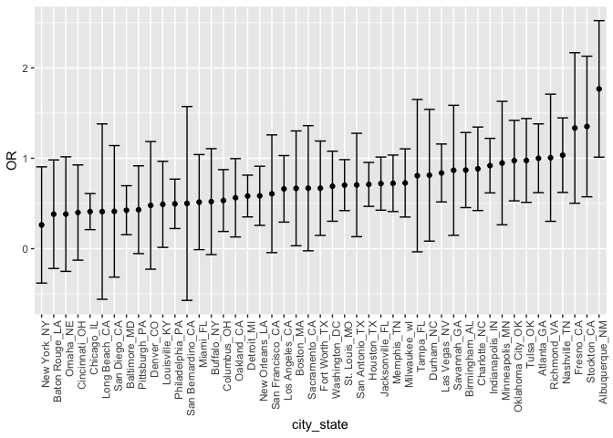
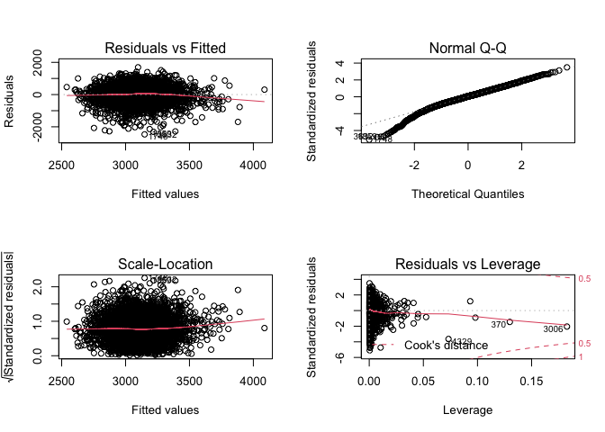
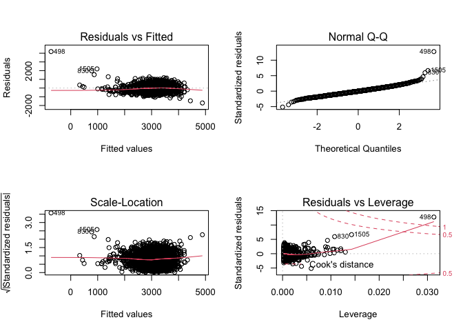
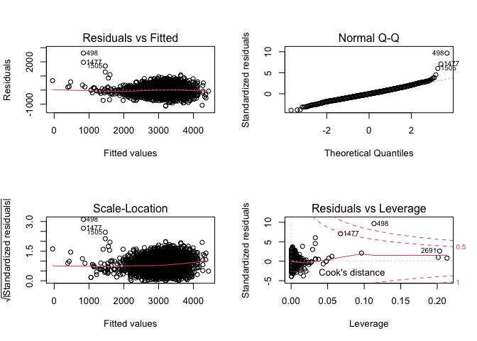

Homework 6
================
Sanjana Batabyal

This is my solution to Homework 6.

``` r
library(tidyverse)
```

    ## ── Attaching packages ─────────────────────────────────────── tidyverse 1.3.0 ──

    ## ✓ ggplot2 3.3.2     ✓ purrr   0.3.4
    ## ✓ tibble  3.0.4     ✓ dplyr   1.0.2
    ## ✓ tidyr   1.1.2     ✓ stringr 1.4.0
    ## ✓ readr   1.4.0     ✓ forcats 0.5.0

    ## ── Conflicts ────────────────────────────────────────── tidyverse_conflicts() ──
    ## x dplyr::filter() masks stats::filter()
    ## x dplyr::lag()    masks stats::lag()

``` r
library(magrittr)
```

    ## 
    ## Attaching package: 'magrittr'

    ## The following object is masked from 'package:purrr':
    ## 
    ##     set_names

    ## The following object is masked from 'package:tidyr':
    ## 
    ##     extract

## Problem 1

Manipulating the dataset to our preferences. Creating a city\_state
variable. Creating a binary resolution variable. Removing cities that do
not report race from dataset.

Focusing on the city of Baltimore, MD.

| term              |    OR | CI\_lower | CI\_upper |
| :---------------- | ----: | --------: | --------: |
| (Intercept)       | 1.363 |     1.028 |     1.699 |
| victim\_age       | 0.993 |     0.987 |     1.000 |
| victim\_raceWhite | 2.320 |     1.978 |     2.663 |
| victim\_sexMale   | 0.426 |     0.155 |     0.696 |

Applying this across all the remaining cities in the dataset.

Creating a plot of hom\_results.
<!-- -->
\#\# Problem 2 Loading and cleaning the data for regression analysis.

    ## 
    ## ── Column specification ────────────────────────────────────────────────────────
    ## cols(
    ##   .default = col_double()
    ## )
    ## ℹ Use `spec()` for the full column specifications.

Proposing a regression model for birthweight. For my own model I will be
seeing the effect of mother’s weight at birth, mother’s age at birth,
and mother’s height.

    ## 
    ## Call:
    ## lm(formula = bwt ~ delwt + mheight + momage + mheight * delwt + 
    ##     momage * delwt + momage * mheight + delwt * mheight * momage, 
    ##     data = birthweight)
    ## 
    ## Residuals:
    ##      Min       1Q   Median       3Q      Max 
    ## -2469.03  -276.07    27.72   311.24  1693.20 
    ## 
    ## Coefficients:
    ##                        Estimate Std. Error t value Pr(>|t|)  
    ## (Intercept)          -4.968e+03  5.390e+03  -0.922   0.3568  
    ## delwt                 6.526e+01  3.701e+01   1.764   0.0779 .
    ## mheight               9.208e+01  8.502e+01   1.083   0.2789  
    ## momage                2.432e+02  2.579e+02   0.943   0.3457  
    ## delwt:mheight        -8.168e-01  5.799e-01  -1.408   0.1591  
    ## delwt:momage         -2.451e+00  1.765e+00  -1.388   0.1652  
    ## mheight:momage       -2.753e+00  4.061e+00  -0.678   0.4979  
    ## delwt:mheight:momage  3.273e-02  2.762e-02   1.185   0.2361  
    ## ---
    ## Signif. codes:  0 '***' 0.001 '**' 0.01 '*' 0.05 '.' 0.1 ' ' 1
    ## 
    ## Residual standard error: 484.7 on 4334 degrees of freedom
    ## Multiple R-squared:  0.1057, Adjusted R-squared:  0.1042 
    ## F-statistic: 73.14 on 7 and 4334 DF,  p-value: < 2.2e-16

    ## # A tibble: 1 x 12
    ##   r.squared adj.r.squared sigma statistic   p.value    df  logLik    AIC    BIC
    ##       <dbl>         <dbl> <dbl>     <dbl>     <dbl> <dbl>   <dbl>  <dbl>  <dbl>
    ## 1     0.106         0.104  485.      73.1 1.99e-100     7 -33006. 66030. 66088.
    ## # … with 3 more variables: deviance <dbl>, df.residual <int>, nobs <int>

    ## # A tibble: 8 x 5
    ##   term                   estimate std.error statistic p.value
    ##   <chr>                     <dbl>     <dbl>     <dbl>   <dbl>
    ## 1 (Intercept)          -4968.     5390.        -0.922  0.357 
    ## 2 delwt                   65.3      37.0        1.76   0.0779
    ## 3 mheight                 92.1      85.0        1.08   0.279 
    ## 4 momage                 243.      258.         0.943  0.346 
    ## 5 delwt:mheight           -0.817     0.580     -1.41   0.159 
    ## 6 delwt:momage            -2.45      1.77      -1.39   0.165 
    ## 7 mheight:momage          -2.75      4.06      -0.678  0.498 
    ## 8 delwt:mheight:momage     0.0327    0.0276     1.18   0.236

<!-- -->
Creating a regression model using length at birth and gestational age as
predictors (main effects only).

    ## 
    ## Call:
    ## lm(formula = bwt ~ blength + gaweeks, data = birthweight)
    ## 
    ## Residuals:
    ##     Min      1Q  Median      3Q     Max 
    ## -1709.6  -215.4   -11.4   208.2  4188.8 
    ## 
    ## Coefficients:
    ##              Estimate Std. Error t value Pr(>|t|)    
    ## (Intercept) -4347.667     97.958  -44.38   <2e-16 ***
    ## blength       128.556      1.990   64.60   <2e-16 ***
    ## gaweeks        27.047      1.718   15.74   <2e-16 ***
    ## ---
    ## Signif. codes:  0 '***' 0.001 '**' 0.01 '*' 0.05 '.' 0.1 ' ' 1
    ## 
    ## Residual standard error: 333.2 on 4339 degrees of freedom
    ## Multiple R-squared:  0.5769, Adjusted R-squared:  0.5767 
    ## F-statistic:  2958 on 2 and 4339 DF,  p-value: < 2.2e-16

    ## # A tibble: 1 x 12
    ##   r.squared adj.r.squared sigma statistic p.value    df  logLik    AIC    BIC
    ##       <dbl>         <dbl> <dbl>     <dbl>   <dbl> <dbl>   <dbl>  <dbl>  <dbl>
    ## 1     0.577         0.577  333.     2958.       0     2 -31381. 62771. 62796.
    ## # … with 3 more variables: deviance <dbl>, df.residual <int>, nobs <int>

    ## # A tibble: 3 x 5
    ##   term        estimate std.error statistic  p.value
    ##   <chr>          <dbl>     <dbl>     <dbl>    <dbl>
    ## 1 (Intercept)  -4348.      98.0      -44.4 0.      
    ## 2 blength        129.       1.99      64.6 0.      
    ## 3 gaweeks         27.0      1.72      15.7 2.36e-54

<!-- -->
Creating a regression model using head circumference, length, sex, and
all interactions (including the three-way interaction) between these.

    ## 
    ## Call:
    ## lm(formula = bwt ~ bhead + blength + babysex + bhead * blength + 
    ##     bhead * babysex + blength * babysex + bhead * blength * babysex, 
    ##     data = birthweight)
    ## 
    ## Residuals:
    ##      Min       1Q   Median       3Q      Max 
    ## -1132.99  -190.42   -10.33   178.63  2617.96 
    ## 
    ## Coefficients:
    ##                         Estimate Std. Error t value Pr(>|t|)    
    ## (Intercept)           -13551.685   2759.413  -4.911 9.39e-07 ***
    ## bhead                    380.189     83.395   4.559 5.28e-06 ***
    ## blength                  225.900     57.398   3.936 8.43e-05 ***
    ## babysex                 6374.868   1677.767   3.800 0.000147 ***
    ## bhead:blength             -4.432      1.715  -2.583 0.009815 ** 
    ## bhead:babysex           -198.393     51.092  -3.883 0.000105 ***
    ## blength:babysex         -123.773     35.119  -3.524 0.000429 ***
    ## bhead:blength:babysex      3.878      1.057   3.670 0.000245 ***
    ## ---
    ## Signif. codes:  0 '***' 0.001 '**' 0.01 '*' 0.05 '.' 0.1 ' ' 1
    ## 
    ## Residual standard error: 287.7 on 4334 degrees of freedom
    ## Multiple R-squared:  0.6849, Adjusted R-squared:  0.6844 
    ## F-statistic:  1346 on 7 and 4334 DF,  p-value: < 2.2e-16

    ## # A tibble: 1 x 12
    ##   r.squared adj.r.squared sigma statistic p.value    df  logLik    AIC    BIC
    ##       <dbl>         <dbl> <dbl>     <dbl>   <dbl> <dbl>   <dbl>  <dbl>  <dbl>
    ## 1     0.685         0.684  288.     1346.       0     7 -30742. 61501. 61559.
    ## # … with 3 more variables: deviance <dbl>, df.residual <int>, nobs <int>

    ## # A tibble: 8 x 5
    ##   term                   estimate std.error statistic     p.value
    ##   <chr>                     <dbl>     <dbl>     <dbl>       <dbl>
    ## 1 (Intercept)           -13552.     2759.       -4.91 0.000000939
    ## 2 bhead                    380.       83.4       4.56 0.00000528 
    ## 3 blength                  226.       57.4       3.94 0.0000843  
    ## 4 babysex                 6375.     1678.        3.80 0.000147   
    ## 5 bhead:blength             -4.43      1.72     -2.58 0.00981    
    ## 6 bhead:babysex           -198.       51.1      -3.88 0.000105   
    ## 7 blength:babysex         -124.       35.1      -3.52 0.000429   
    ## 8 bhead:blength:babysex      3.88      1.06      3.67 0.000245

<!-- -->
\#\#Problem 3
